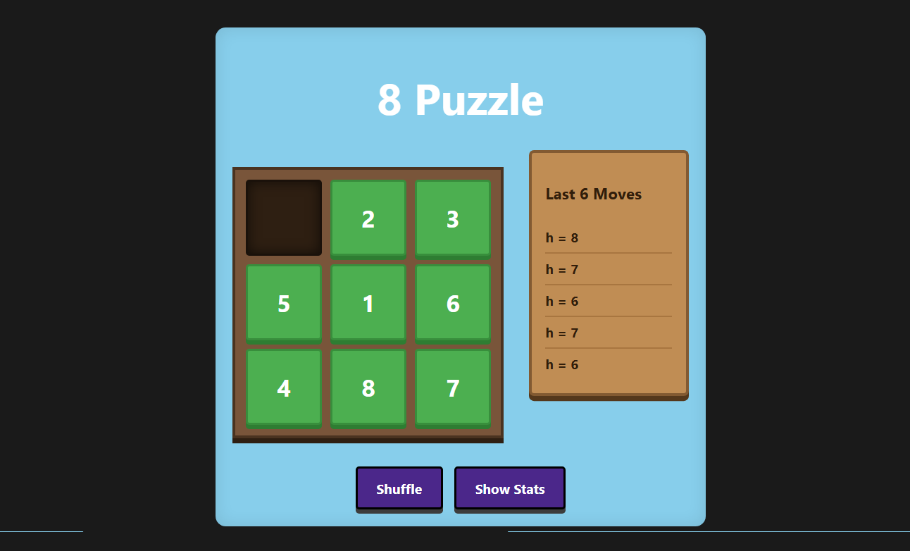

# 🧩 8 Puzzle — React Implementation

An interactive implementation of the classic **8-Puzzle Problem** built with React + Vite.

The application demonstrates puzzle mechanics along with the **Manhattan Distance heuristic**, displayed live as you make moves.

## ✨ Features

- Solvable random shuffling  
- Valid tile movement  
- Goal state detection  
- Manhattan distance heuristic display  
- Simple interactive UI  

## 🚀 Future Plans

This project is part of a larger AI problem collection. Planned implementations include:

- N-Queens  
- Missionaries & Cannibals (Monks & Demons)  
- Water Jug Problem  
- Tic-Tac-Toe (AI / Minimax)  
- Other classic search problems  

Eventually, the system will be migrated to a **full-stack architecture** for better performance and management:

- 🐍 Python backend (FastAPI) for algorithms & solvers  
- ⚛️ React frontend for interactive visualization  

---

Built as part of my 6th Semester AI Assignment Submission
